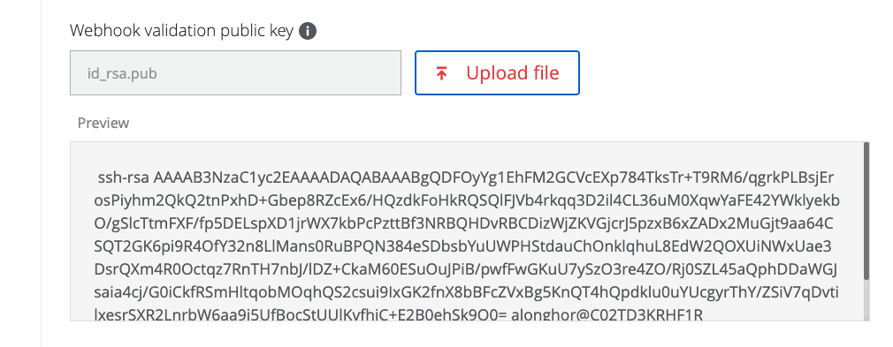
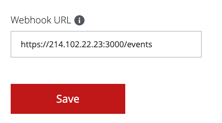
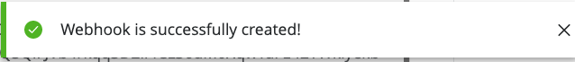

# Introduction

This is a "hello world" example of how to create a web hook processing endpoint for McAfee MVision API

# Run the Example Webhook Endpoint Server

clone the repo:
```bash
git clone ...
cd ...
```

Install the dependencies:
```bash
npm i
```

create the keypair:
```bash
ssh-keygen 
Generating public/private rsa key pair.
Enter file in which to save the key (/Users/alonghor/.ssh/id_rsa): ./id_rsa
Enter passphrase (empty for no passphrase): 
Enter same passphrase again: 
Your identification has been saved in ./id_rsa.
Your public key has been saved in ./id_rsa.pub.
The key fingerprint is:
SHA256:xxxxxxxxxxxxxxxxxxxxxxxxxxxxxxxxxxxxxxxxxx user@host
The key's randomart image is:
+---[RSA 3072]----+
|        .   ...  |
|         o . +o o|
|        o . .o*.+|
|         .   o Bo|
|        S   . o+B|
|           S o.BB|
|          . o.X+B|
|           o E+B=|
|       o    oo==B|
+----[SHA256]-----+
```

Run the example server:
```bash
node index.js
```

# Set up the webhook in the MVision Developer Portal

Go to https://developer.mvision.mcafee.com, find the <b>Self-Service -> API Hub Management</b> section

Select the MVision ePO Category and select all event types


Upload the public key you generated when starting the example webhook endpoint server above (it's the id_rsa.pub file you created with ssh-keygen)



Configure the webhook url (you need to use the public IP for your example server you set up above)



Save your configuration. You should then see a success message:



You should now see events coming through to your server as they occur in MVision.
